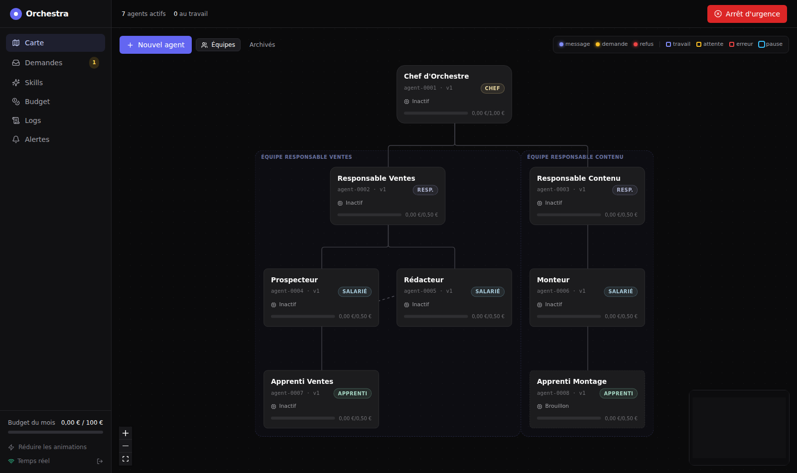

# Orchestra

Plateforme **locale**, **sécurisée** et **observable** pour diriger une organisation d'agents IA :
Chef d'Orchestre → Responsables → Salariés → Apprentis. Le Propriétaire (vous) pilote tout depuis une
**carte animée** ; toute la connaissance vit dans un **second cerveau Obsidian** ; tout est **journalisé de
façon infalsifiable** ; le budget est plafonné à **100 €/mois**.



## Tester le MVP en 2 minutes (Windows)

Seul prérequis : **Python 3.11+** (le lanceur propose de l'installer s'il manque). Pas de Docker, Node, Ollama ni clé API.

1. Téléchargez le dépôt (bouton **Code → Download ZIP** sur GitHub, branche `claude/ecstatic-hamilton-izxg8m`) et
   décompressez-le, par exemple dans `C:\Orchestra`.
2. Double-cliquez sur **`MVP.bat`**.
3. Le navigateur s'ouvre, déjà connecté, sur une **organisation de démonstration** (Chef, 2 Responsables,
   3 Salariés, 2 Apprentis) animée par la **simulation** : tâches, comptes rendus, demandes, refus de permission…

À essayer : cliquer sur un agent (6 onglets), modifier ses instructions, *Nouvel agent*, page **Demandes**
(accepter / refuser), **Logs** (recherche, vérification d'intégrité), **Skills**, l'**arrêt d'urgence**, le bouton
*Simulation en cours* pour mettre en pause, et le dossier `Cerveau` ouvert dans Obsidian (les notes bougent en direct).
Fermer la fenêtre noire arrête tout. Repartir de zéro : `powershell -ExecutionPolicy Bypass -File mvp.ps1 -Reinitialiser`.
Linux/macOS : `./mvp.sh`.

> Les agents de la démo utilisent le modèle hors ligne `demo/echo` : ils suivent les vraies règles (permissions,
> messagerie, journal, coffre) mais ne « pensent » pas. Pour du vrai travail, changez le **Modèle** d'une fiche
> (`ollama/qwen2.5:7b` après `ollama pull qwen2.5:7b`, ou une API gratuite avec sa clé dans `.env`).

## Démarrage complet (Windows)

```powershell
git clone https://github.com/Light669/jarvis.git C:\Orchestra
cd C:\Orchestra
.\detect.ps1 -Install -Apply   # détecte le PC, installe ce qui manque (winget), règle le modèle local
ollama pull qwen2.5:7b          # le modèle recommandé par detect.ps1
.\start.ps1                     # lance tout ; le navigateur s'ouvre, déjà connecté
```

Arrêt : `.\stop.ps1`. Essai sans rien configurer : `.venv\Scripts\python -m orchestra demo` (organisation de
démonstration hors ligne, modèle `demo/echo`) avant `.\start.ps1`.

Sous Linux/macOS : `./start.sh` et `./stop.sh`.

## Ce que fait la plateforme

| Besoin | Où |
|---|---|
| Créer / modifier / mettre en pause / promouvoir / licencier un agent | Carte → **Nouvel agent** ou clic sur un agent (ou une note dans `Cerveau/Agents/`) |
| Voir ce que fait chaque agent, ses messages, skills, historique, coûts | Panneau latéral (6 onglets) |
| Demandes formelles (outil, budget, aide, validation, skill d'équipe, promotion, plateforme) | Page **Demandes** (escalade automatique) |
| Compétences réutilisables, en nombre illimité, testées et revues | Page **Skills**, `Cerveau/Skills/` |
| Journal infalsifiable, recherche, export CSV, vérification d'intégrité | Page **Logs**, `logs/*.jsonl`, `Cerveau/Logs/` |
| Budget en direct, alerte à 80 %, blocage à 100 % | Page **Budget** |
| Tout geler en moins de 5 secondes | Bouton **Arrêt d'urgence** (toutes les pages) |
| Rapports quotidiens, rétrospective hebdomadaire, retour arrière automatique | `Cerveau/Rapports/`, `Cerveau/Decisions/` |

## Architecture

```
 Navigateur (127.0.0.1:8765, jeton)          Obsidian (C:\Orchestra\Cerveau)
        │  REST + WebSocket                        ▲  Markdown + YAML + [[liens]] + Git
        ▼                                          │
 ┌──────────────── processus Python (hôte) ────────┴──────────────────────┐
 │ API FastAPI ─ Permissions (seul point d'autorisation) ─ Journal chaîné │
 │ Agents · Messagerie/Demandes · Budget · Skills · Amélioration continue │
 │ Scribe (synchro base ⇄ coffre, Git, index FTS5) · Planificateur        │
 │ LLM Gateway : Ollama → Groq → Gemini → OpenRouter → Mistral (repli)    │
 └───────────────┬───────────────────────────────┬────────────────────────┘
                 │ SQLite (WAL + FTS5)           │ docker run --network none --read-only …
            data/orchestra.db              conteneur jetable par exécution de code / skill
 Notifier (hôte) : écoute les alertes → notifications Windows
```

Détails : [`docs/architecture.md`](docs/architecture.md) · choix techniques : [`docs/decisions.md`](docs/decisions.md) ·
sécurité : [`docs/securite.md`](docs/securite.md) · guide : [`docs/guide_utilisateur.md`](docs/guide_utilisateur.md) ·
avancement et recette : [`docs/avancement.md`](docs/avancement.md).

## Commandes

| Commande | Rôle |
|---|---|
| `.\detect.ps1 [-Install] [-Apply]` | Détection du PC, prérequis, dimensionnement |
| `.\start.ps1 [-Rebuild] [-NoBrowser]` / `.\stop.ps1` | Lancer / arrêter tout |
| `python -m orchestra init` | Créer coffre, base, dossiers |
| `python -m orchestra demo` | Organisation de démonstration (base vide) |
| `python -m orchestra verify-logs` | Vérifier la chaîne de hash des logs (code 2 si altération) |
| `python -m orchestra scan-secrets` | Rechercher des secrets dans `logs/` et le coffre (code 3 si trouvé) |

(`python` = `.venv\Scripts\python.exe` après le premier `start.ps1`.)

## Configuration

- `config.yaml` : plafond budgétaire, seuils (alerte, promotion, escalade, anti-boucle, retour arrière),
  limites des conteneurs, chaîne de modèles et prix. **Modifiable uniquement par vous.**
- `.env` (jamais commité) : `ORCHESTRA_TOKEN` (généré), clés gratuites optionnelles `GROQ_API_KEY`,
  `GEMINI_API_KEY`, `OPENROUTER_API_KEY`, `MISTRAL_API_KEY`.

## Tests

```powershell
.venv\Scripts\python -m pytest              # 135+ tests, dont la recette des 12 critères (tests/e2e/test_acceptance.py)
```
Le test navigateur (`tests/e2e/test_dashboard.py`) nécessite `pip install playwright` + `playwright install chromium`
et un tableau de bord construit (`npm run build` dans `platform/dashboard`).

## Faire tourner l'entreprise

Une fois la plateforme lancée, créez le **Chef d'Orchestre** (carte → *Créer le Chef d'Orchestre*) et collez le
prompt « Chef d'Orchestre » dans ses **Instructions**. Il est injecté à chaque tâche, avec les règles communes de
la plateforme. Ses droits restent ceux que le code lui accorde : il ne peut ni dépasser le budget, ni agir à
l'extérieur sans votre validation, ni modifier la plateforme.
